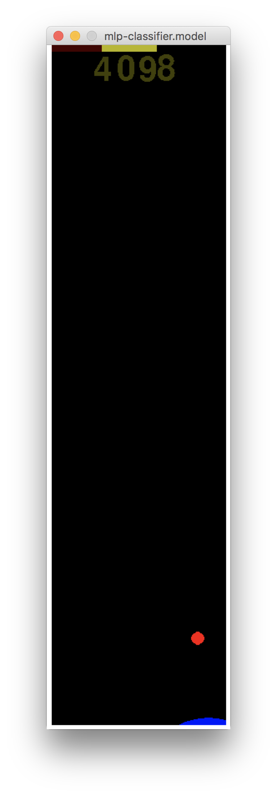

# Well Bouncer

Well Bouncer is a simple game for experimenting with unsupervised learning.

You can see some example self-play (using a Multi-layer Perceptron classifier
with 2 layers of 20 hidden nodes) by clicking this image:

## License

This project is licensed under the Apache License - see the [LICENSE](../LICENSE) file for details
